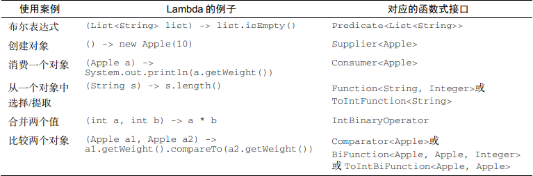

# Java API 中常用函数式接口 、原始类型特化 以及 小练习
## Java API中常见的函数式接口 以及对应的 函数描述符  
```  
Predicate<T>            T->boolean          谓词
Consumer<T>             T->void             消费者
Function<T,R>           T->R                函数
Supplier<T>             ()->T               提供者
UnaryOperator<T>        T->T                一元运算符
BinaryOperator<T>       (T,T)->T            双元运算符
BiPredicate<L,R>        (L,R)->boolean      双参数谓词
BiConsumer<T,U>         (T,U)->void         双参数消费者
BiFunction<T,U,R>       (T,U)->R            双参数函数
```  
### 小补充  
这里的"Bi" （Binary） 是 “双”的意思，可以简单理解为 “双参数”，即需要两个参数， 方便记忆  
## 焦点问题  
在使用函数式接口的过程中，我们通常使用的函数式接口参数及返回值通常都是引用类型，  
如果我们使用原始类型也没关系，系统会自动进行装箱（原始类型变引用类型）和拆箱（引用类型变原始类型）操作，  
但是性能方面要付出更多的代价：因此，装箱后的值需要更多的内存，并需要额外的内存搜索来获取被包裹的原始值。
## 解决问题  
Java 又提供了 函数式接口的原始类型特化  
## 理解原始类型特化  
原始类型特化？  针对以上那些（使用引用类型作为参数的）函数式接口的一个专门的函数式接口版本    
特点：这些特殊版本的函数式接口的抽象方法参数全是原始类型  
目的：以便在输入和输出都是原始类型时避免自动装箱的操作    
## Java 8 中的 常用函数式接口 与 其原始类型特化 的对应关系    
  
  
## 根据 函数描述符 反推可用的 函数式接口  
```text  
(1) T->R
(2) (int, int)->int
(3) T->void
(4) ()->T
(5) (T, U)->R
答案如下。
(1) Function<T,R>不错。
它一般用于将类型T的对象转换为类型R的对象（比如Function<Apple, Integer>用来提取苹果的重量）
(2) IntBinaryOperator具有唯一一个抽象方法，叫作applyAsInt，
它代表的函数描述符是(int, int) -> int
(3) Consumer<T>具有唯一一个抽象方法叫作accept，代表的函数描述符是T -> void
(4) Supplier<T>具有唯一一个抽象方法叫作get，代表的函数描述符是()-> T
或者，Callable<T>具有唯一一个抽象方法叫作call，代表的函数描述符是() -> T
(5) BiFunction<T, U, R>具有唯一一个抽象方法叫作apply，代表的函数描述符是(T,U) -> R
```  
## Lambdas 及 函数式接口 的常见案例  
表达式，以后不特别说明， Lambda 就是指 Lambda表达式  
  
