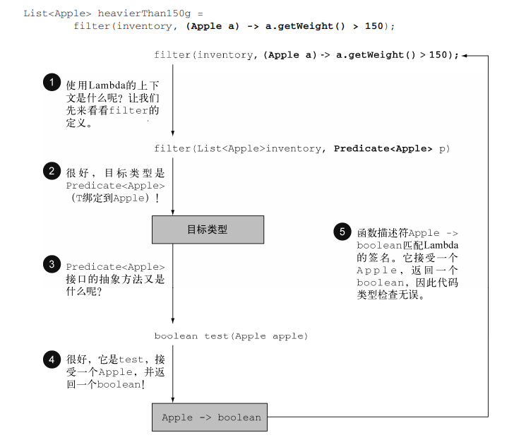

## Lambda类型检查（系统怎样判断你使用的Lambda类型是否正确？）  
正确的Lambda的类型是从使用Lambda表达式的上下文推断出来的。
## Lambda的上下文 和 目标类型
**上下文就是接受Lambda传递的方法的参数、或者接受它的值得局部变量**    
**目标类型就是上下文中Lambda表达式需要的类型**  
```text
Predicate<Apple> p = (Apple a) -> a.getWeight() > 150;
此时
Lambda的上下文就是接受它的值的局部变量： Predicate<Apple> p  
Lambda需要的目标类型就是： Predicate<Apple>  
```  
```text
List<Apple> heavierThan150g = filter(inventory, (Apple a) -> a.getWeight() > 150); 
filter的方法定义是：
    public static <T> List<T> filter(List<T> list, Predicate<T> p) {
        List<T> results = new ArrayList<>();
        for (T s : list) {
            if (p.test(s)) {
                results.add(s);
            }
        }
        return results;
    }
此时
Lambda的上下文就是接受它传递的方法的参数： Predicate<Apple> p  
Lambda需要的目标类型就是： Predicate<Apple>  
```  
## 当目标类型的函数描述符与你使用的Lambda的签名一致时，类型检查通过，即系统认为你使用的Lambda类型是正确的。
### 举例子  
   
上述图中的类型检查过程可分解为5步：  
```text
类型检查过程可以分解为如下所示。
 首先，你要找出filter方法的声明。
 第二，要求它是Predicate<Apple>（目标类型）对象的第二个正式参数。
 第三，Predicate<Apple>是一个函数式接口，定义了一个叫作test的抽象方法。
 第四，test方法描述了一个函数描述符，它可以接受一个Apple，并返回一个boolean。
 最后，filter的任何实际参数都必须匹配这个要求。
```    
```text
总结一下它的核心步骤：   
1、找到使用Lambda表达式 (Apple a) -> a.getWeight() > 150 的上下文为 Predicate<Apple> p    
2、由1可知目标类型为Predicate<Apple>  
3、判断目标类型的函数描述符为：(Apple) -> boolean  
4、判断所使用的Lambda表达式的签名为：(Apple) -> boolean  
5、目标类型的函数描述符与所使用的的Lambda表达式的签名完全一致，所以类型检查通过。  
其实问题最终又回到了：_3_2._3_2_2.WhereToUseLambda2 —— 在函数描述符上使用Lambda
```

-----

